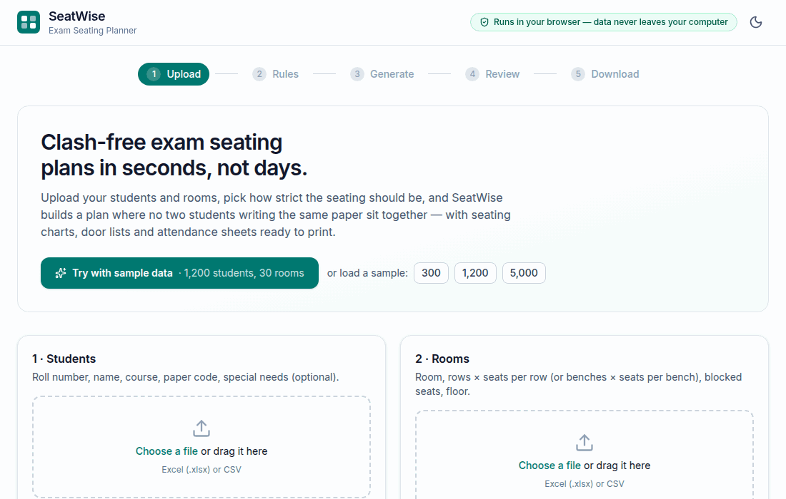
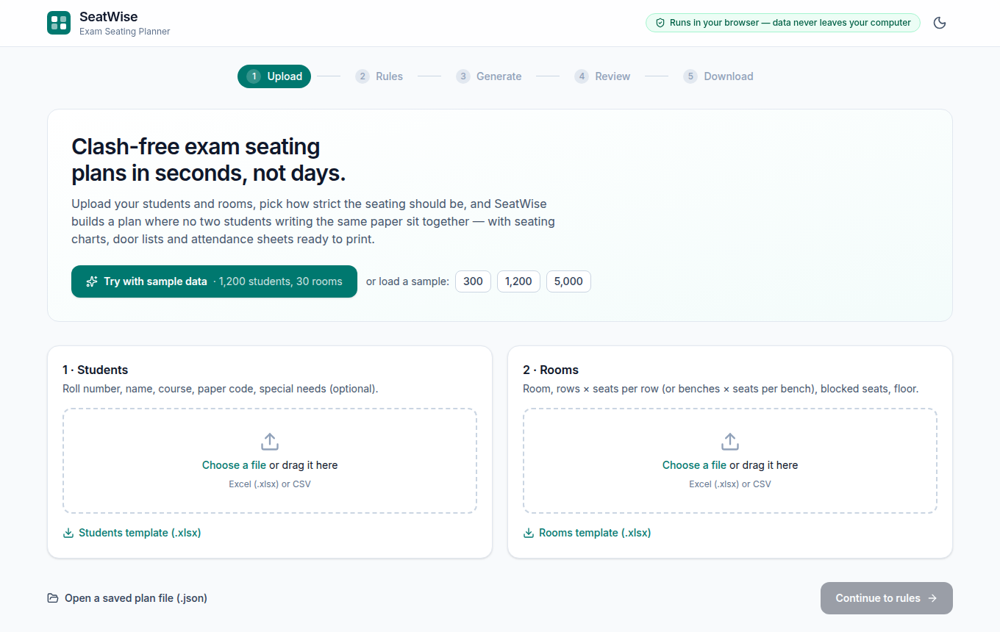
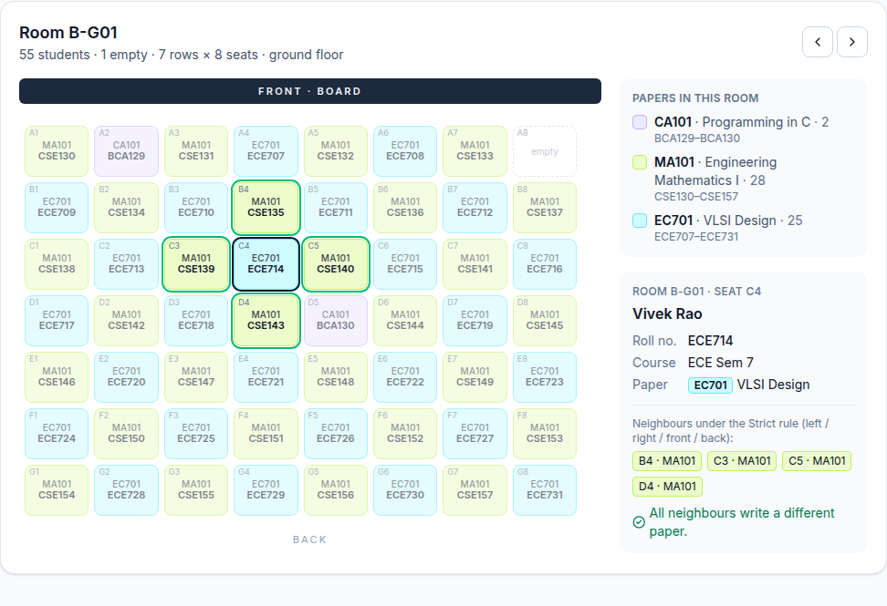
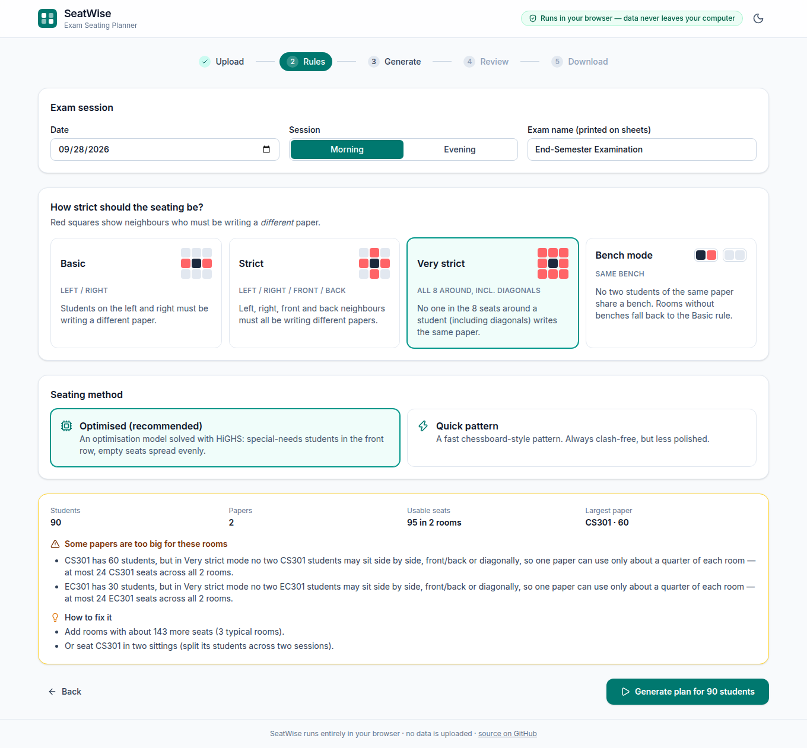
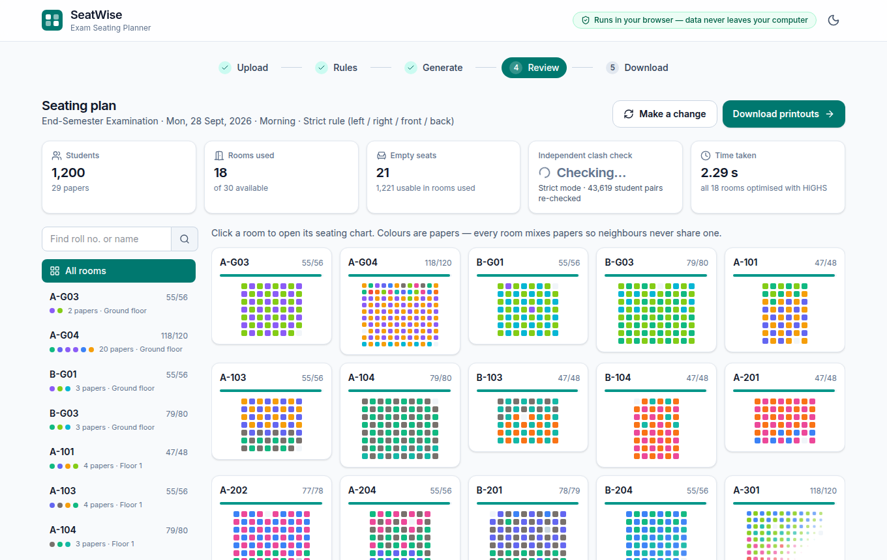
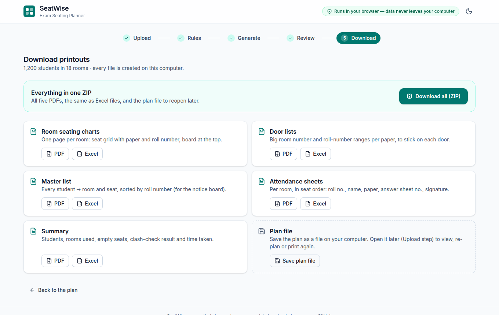
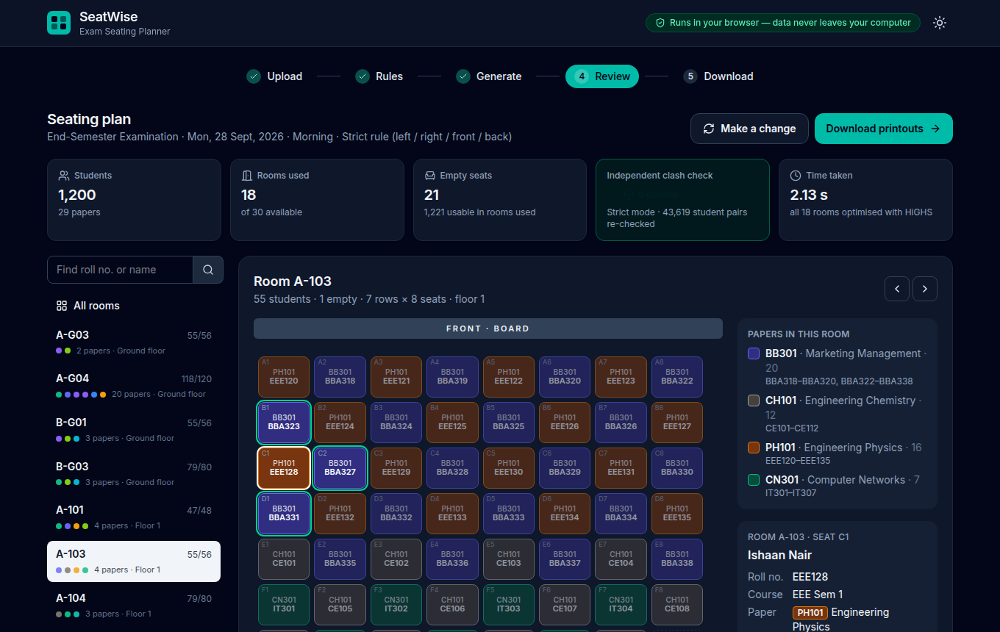

# SeatWise — Exam Seating Planner

**Clash-free exam seating plans in seconds — generated entirely in your browser.**
Upload students and rooms, pick how strict the seating must be, and SeatWise
builds a plan where no two students writing the same paper sit together, with
seating charts, door lists, attendance sheets and a master list ready to print.

**Live demo: [exam-seating-planner-sand.vercel.app](https://exam-seating-planner-sand.vercel.app)** — click **“Try with sample data”** to see 1,200 students seated in about two seconds.



[](https://github.com/khaira8905/exam-seating-planner/actions/workflows/ci.yml)

---

## The problem

In most Indian colleges the exam cell builds seating plans by hand in Excel.
Hundreds or thousands of students from different courses write in the same
session, and students writing the **same paper must not sit next to each other**.
On top of the plan, the cell needs a seating chart for every room, lists for
every door, attendance sheets and a master list for the notice board. It takes
days — and every last-minute change (a room is locked, a student is added)
means redoing it by hand.

## What SeatWise does

1. **Upload** two files (Excel `.xlsx` or CSV) — or click *Try with sample data*.
   - Students: roll number, name, course, paper code, special needs (optional)
   - Rooms: room, rows × seats per row (or benches × seats per bench), blocked seats, floor (optional)
   - Downloadable templates explain every column; mistakes get friendly messages like *“Row 14: roll number missing.”*
2. **Choose the rules**: date, morning/evening, and strictness —

   | Rule | Must write a different paper |
   |---|---|
   | Basic | left and right neighbours |
   | Strict | left, right, front and back |
   | Very strict | all 8 seats around, including diagonals |
   | Bench mode | everyone on the same bench (rooms without benches use Basic) |

3. **Generate** — a clash-free plan in a few seconds, or a plain-English explanation of why it's impossible and how to fix it:
   *“CS301 has 60 students, but in Very strict mode … at most 24 CS301 seats across all 2 rooms. Add rooms with about 143 more seats …”*
4. **Review** each room as an interactive seat grid: hover or tab to a seat to see the student and highlight the neighbours the rule protects.
5. **Download** print-ready PDFs and Excel files — or everything as one ZIP.
6. **Re-plan** after a last-minute change, moving as few students as possible.

| Upload | Review a room | Impossible? It says why |
|---|---|---|
|  |  |  |

| All rooms | Downloads | Dark mode |
|---|---|---|
|  |  |  |

### Printouts (PDF + Excel)

1. **Room seating chart** — grid of seats (paper code + roll number), board at the top, room/date/session in the header, legend with roll-number ranges
2. **Door list** — big room number, roll-number ranges per paper, total
3. **Master list** — every student → room + seat, sorted by roll number
4. **Attendance sheet** per room, in seat order — seat, roll no., name, paper, answer sheet no., signature
5. **Summary** — students, rooms used, empty seats, clash-check result, time taken

## Privacy: your data never leaves your computer

SeatWise has **no server and no database**. The website is a set of static
files; once loaded, everything — reading your Excel files, solving, drawing,
making PDFs — happens inside your browser tab. Student names and roll numbers
are never uploaded anywhere. The only thing stored is the latest plan, in
*your* browser's IndexedDB (so a refresh doesn't lose work), with a *Forget*
button. This keeps students' personal data under the exam cell's control, in
the spirit of India's **Digital Personal Data Protection (DPDP) Act, 2023**.
Once the page has loaded, it keeps working without a connection.
This is enforced, not just promised: the site is served with a strict
[Content Security Policy](vercel.json) (`connect-src 'self'`), so the browser itself
blocks any attempt to send data to another website.

## How it works

The plan is built in three stages. The code is plain TypeScript in
[`src/lib/engine`](src/lib/engine) and runs in a Web Worker, so the page never freezes.

### Stage 1 — room allocation (greedy)

Each room's seats are split into **classes where no two seats are neighbours**
under the chosen rule — a chessboard for Strict, 2 × 2 tiles for Very strict,
alternate columns for Basic, bench positions for Bench mode. That gives a simple,
explainable limit: *one paper can use at most about half a room in Strict mode*
(a quarter in Very strict).

- **Feasibility first:** if there are fewer seats than students, or a paper is
  bigger than what all rooms allow for one paper, SeatWise stops and explains
  it with numbers and fixes (add N seats, relax to Basic, split the paper).
- **Fewest rooms, filled evenly:** it picks the largest rooms until everyone
  fits and gives every chosen room the same fill ratio.
- **Mixed and together:** papers are laid along the rooms' seat classes in
  *class-major* order (every room's first class, then every room's second
  class …). Each paper stays in neighbouring rooms, and every room gets a mix
  of 2–4 papers. A paper never takes two classes in one room, which makes each
  room clash-free by construction.
- **Special needs:** those students are reserved seats on the **ground floor** first.

### Stage 2 — seats in each room

- **Method A — pattern filling (fast baseline):** each paper fills its seat class
  front to back; empty seats are spread out. A few milliseconds for 5,000 students.
- **Method B — optimisation model (default), solved with [HiGHS](https://highs.dev)
  compiled to WebAssembly:**

  ```text
  x[p,s] ∈ {0,1}                 seat s holds a student of paper p
  Σp x[p,s] ≤ 1                  every usable seat holds at most one student
  Σs x[p,s] = count[p]           every student gets a seat
  Σ(s∈C) x[p,s] ≤ 1              for every group C of mutually neighbouring seats
                                 (a pair, a bench, or a 2×2 block) and every paper p
  blocked seats                  have no variables at all
  minimise  100 · special-needs students not in the front two rows
          +  10 · students moved (when re-planning)
          +   1 · how unevenly empty seats are spread across rows
          +  tiny tie-break that keeps each paper in a compact block
  ```

  The pattern plan is handed to HiGHS as a **warm start**, and HiGHS gets at most
  1 second per room (keeping the best plan found). Together these cut the
  5,000-student Very strict case from 11.2 s to 4.4 s. Finally, students are placed in
  **roll-number order**, special-needs students first into their paper's front seats.

### Stage 3 — an independent checker

[`checker.ts`](src/lib/engine/checker.ts) shares **no code** with the solver. It
re-checks every pair of students in every room with plain row/column arithmetic,
plus bookkeeping (everyone seated exactly once, no blocked or double-booked
seats). The app shows its result — *“0 clashes · Strict mode · 43,619 student
pairs re-checked”* — and every test relies on it.

### Re-planning

When a student is added or removed, a room becomes unavailable or a seat breaks:
valid seats are kept, displaced students take a free seat with no same-paper
neighbour, and if needed one room is re-solved with HiGHS where keeping a seat's
paper is rewarded. Example from the 1,200-student sample: taking away a
47-student room moved exactly those 47 students; the other 1,153 stayed put.
The page lists every move and highlights it in the seat grid.

## Benchmarks (real measurements)

Sample sessions from the built-in generator (`npm run bench`). Every plan was
re-checked by the independent checker: **0 clashes in all 24 cases**
(3 sizes × 4 rules × 2 methods). Full table: [docs/benchmark.md](docs/benchmark.md).

_Node v22.22.2 · Intel Xeon @ 2.10 GHz (4 threads) · median of 3 runs_

| Students | Rooms used / available | Rule | Pattern | HiGHS (optimised) | Clashes |
|---:|---:|---|---:|---:|---:|
| 300 | 6 / 10 | Strict | 3 ms | 0.40 s | 0 |
| 300 | 6 / 10 | Very strict | 3 ms | 0.97 s | 0 |
| 1,200 | 18 / 30 | Strict | 6 ms | 1.50 s | 0 |
| 1,200 | 18 / 30 | Very strict | 4 ms | 3.07 s | 0 |
| 5,000 | 81 / 117 | Strict | 16 ms | 2.01 s | 0 |
| 5,000 | 81 / 117 | Very strict | 17 ms | 4.37 s | 0 |

**In the browser** (production build, headless Chromium, same machine; [details](docs/benchmark-browser.md)):
1,200 students in Strict mode take **about 2.5 s** from clicking *Generate* to the
plan on screen; 5,000 students take 3.6 s (Strict) and 5.9 s (Very strict).

**What the optimiser adds** over the pattern method (same benchmark): at 1,200
students, special-needs students in the front two rows go from 88% to 100%, and
the average gap in empty seats between a room's rows drops from 1.17 to 1.00.
At 5,000 students HiGHS reaches 77–89% (pattern: 77–84%), limited by how many
front-row ground-floor seats the rule allows (see Limitations).

**Tests:** 74 Vitest tests, including property tests that generate **1,200 random
sessions** (random room shapes, benches, blocked seats, floors, paper mixes and
rules) and assert that the checker finds 0 clashes whenever a plan is returned.

## Run it locally

```bash
git clone https://github.com/khaira8905/exam-seating-planner.git
cd exam-seating-planner
npm install          # SheetJS is installed from the official cdn.sheetjs.com tarball
npm run dev          # http://localhost:5173
```

| Command | What it does |
|---|---|
| `npm test` | unit + property tests (Vitest) |
| `npm run typecheck` / `npm run lint` | TypeScript / oxlint |
| `npm run build` | production build into `dist/` |
| `npm run bench` | benchmark 300 / 1,200 / 5,000 students; writes `docs/benchmark.md` |
| `npm run sample-files` | writes sample and template Excel files into `samples/` |

Sample files you can upload are in [`samples/`](samples) (all names are randomly generated), including
`engineering-students-1200.xlsx` + `engineering-rooms-30.xlsx`: 1,200 B.Tech Sem 3 students (CSE, ECE, ME, CE) writing
4 subjects, and 30 rooms. They seat with 0 clashes under all four rules (18 rooms; 22 in Very strict mode).

## Deploy on Vercel

It is a static Vite site — no configuration file is needed.

1. Go to [vercel.com](https://vercel.com) → **Sign Up / Log In** → **Continue with GitHub**.
2. **Add New… → Project** → find **exam-seating-planner** → **Import**
   (if it isn't listed: *Adjust GitHub App Permissions* and give Vercel access to the repo).
3. Vercel detects **Vite** (build command `npm run build`, output directory `dist`). Click **Deploy**.
4. After about a minute you get a link (this project: https://exam-seating-planner-sand.vercel.app).
   Every push to `main` redeploys automatically.

## Tech stack

- **React 19 + TypeScript + Vite**, **Tailwind CSS v4**, **Motion** for animation, lucide icons
- **HiGHS** (WebAssembly, npm `highs`) for the optimisation model, in a **Web Worker**
- **SheetJS** (from the official SheetJS CDN) for Excel/CSV in and out
- **pdfmake** for PDFs, **JSZip** for “download all”, **IndexedDB** for autosave
- **Vitest** + **fast-check** (property tests), **oxlint**, **GitHub Actions** CI (typecheck, lint, tests, build)

Accessibility: keyboard navigation (arrow keys move between seats), visible focus,
labelled controls, the seat chart is a real table for screen readers, light and
dark themes, and no motion for people who turn on *reduce motion*.

## Limitations

- **Conservative allocation.** The allocator's capacity rule (one seat class per paper per room) can
  reject some very tight sessions that are actually possible. It then falls back to splitting papers
  freely and asking the exact HiGHS model per room, but across many rooms you may occasionally need one
  more room than strictly necessary.
- **Special needs are best-effort.** Ground floor and front rows are preferred, not guaranteed: in the
  5,000-student sample (68 special-needs students) 77–89% got a front-two-row seat, because the rule
  limits how many front-row, ground-floor seats one paper can use.
- **“Neighbour” is geometric.** Rooms are rectangular grids; aisles, pillars and odd layouts must be
  approximated with blocked seats. Diagonal and bench rules assume evenly spaced seats.
- **One session at a time.** It doesn't schedule exams across days or assign invigilators.
- **Times depend on the computer.** HiGHS stops after 1 s per room and keeps its best plan, so on a slow
  laptop a big room may keep the pattern layout instead (still clash-free).
- **Browser storage is per device.** Autosave lives only in that browser; use *Save plan file* to move a plan.

## License

MIT — see [LICENSE](LICENSE). Sample data is randomly generated; no real student data is included.
